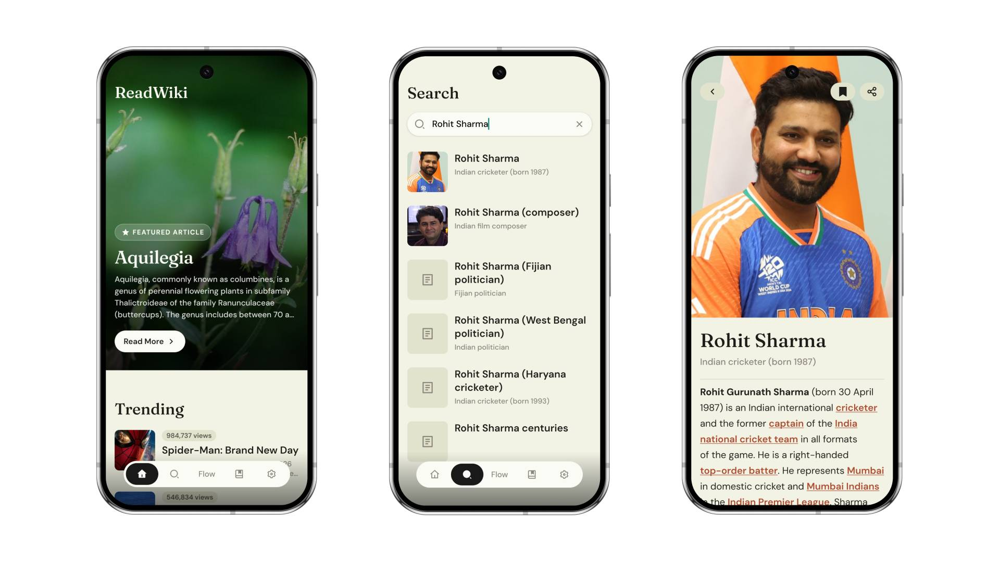

<p align="center">
  
</p>

# ReadWiki

<p align="left">
  <a href="https://play.google.com/store/apps/details?id=com.pratksharma.readwiki">
    
  </a>
</p>

<p align="left">


</p>

**ReadWiki** is a modern, open-source mobile Wikipedia reader engineered for seamless knowledge discovery. Built with **React Native** and **Expo**, ReadWiki reimagines how users explore Wikipedia on mobile devices by delivering a fast, beautiful, and distraction-free reading experience.

Whether you're diving deep into complex topics, browsing daily curated trivia, or scrolling through an infinite flow of articles, ReadWiki turns human knowledge into an effortless daily habit.

## Screenshots

<p align="center">
  
  &nbsp;
  
</p>

## Key Features

- **Curated Home & Discovery Feed**: Daily featured articles, _On This Day_ historical events, breaking news, and _Did You Know?_ trivia snippets.
- **Article Flow Feed**: Scroll through an immersive feed of fascinating Wikipedia articles.
- **Instant Search**: Powerful real-time Wikipedia search with instant article previews and suggestions.
- **Distraction-Free Reader**: Enhanced reading experience featuring custom serif typography (_Fraunces_) and clean sans-serif body (_DM Sans_).
- **Bookmarks & Saved Articles**: Save articles locally to revisit anytime, even offline.
- **Native Performance**: Ultra-responsive UI built with `react-native-reanimated` and Expo SDK components.

## Tech Stack & Architecture

| Technology     | Description                                                                       |
| :------------- | :-------------------------------------------------------------------------------- |
| **Framework**  | [React Native](https://reactnative.dev/) + [Expo](https://expo.dev/)              |
| **Routing**    | [Expo Router](https://docs.expo.dev/router/introduction/) (File-based navigation) |
| **Language**   | [TypeScript](https://www.typescriptlang.org/)                                     |
| **Animations** | [React Native Reanimated](https://docs.swmansion.com/react-native-reanimated/)    |
| **Typography** | Google Fonts (`Fraunces` & `DM Sans` via `@expo-google-fonts`)                    |
| **Parser**     | `htmlparser2` (Custom Wikipedia HTML sanitizer & renderer)                        |
| **API**        | [Wikimedia REST API](https://www.wikimedia.org/api/rest_v1/)                      |

---

## Project Structure

```
ReadWiki/
├── assets/             # App icons, splash screens, and static media
├── src/
│   ├── app/            # Expo Router file-based pages and navigation
│   │   ├── (tabs)/     # Primary tab bar views (Home, Flow, Search, Saved, Settings)
│   │   ├── article/    # Detailed article view & table of contents
│   │   ├── onboarding.tsx
│   │   └── ...         # Dedicated sub-pages (News, Trending, On-this-day, etc.)
│   ├── components/     # Reusable UI components & custom reader controls
│   ├── constants/      # Design tokens, theme colors, typography definitions
│   ├── hooks/          # Custom React hooks for data fetching & theme handling
│   ├── services/       # Wikipedia REST API integrations & data mappers
│   └── utils/          # HTML parsing, text formatting, and offline helpers
└── app.json            # Expo app configuration
```

---

## Why ReadWiki?

Wikipedia contains an incredible amount of human knowledge, but reading and discovering articles on mobile can often feel outdated or cluttered. ReadWiki reimagines the experience with modern mobile design principles, prioritizing speed, readability, and effortless navigation.

---

## License

Distributed under the Apache License 2.0. See [`LICENSE`](./LICENSE) for details.
